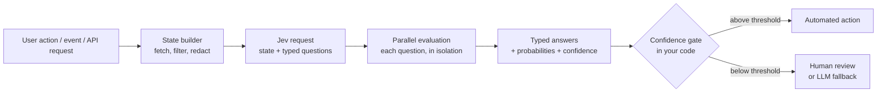
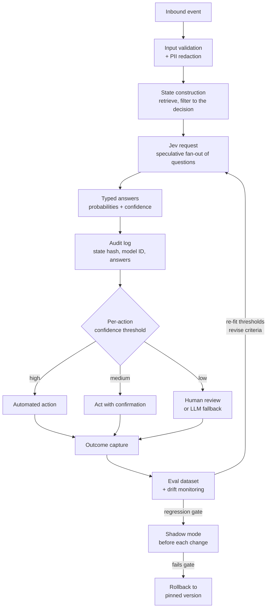
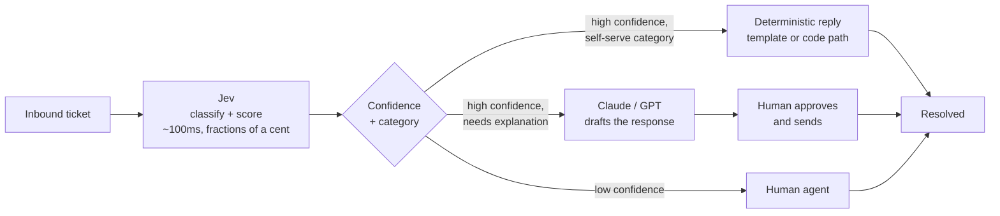

> **What if an AI model didn't write paragraphs, but made reliable typed decisions your code could act on?**

**Jev is not a chatbot.** It is a fast, structured decision model built to sit inside software: you hand it program state and typed questions, and it hands back typed answers with calibrated probabilities — no prose, no JSON parsing, no schema coercion.

---

## Executive summary

> **TL;DR**
>
> - **What it is.** Jev is the first publicly released *System One model* — TypeSafe AI's term for a class of models that return typed probabilistic decisions instead of generated text.
> - **Who built it.** TypeSafe AI, a San Francisco lab that came out of stealth on **15 September 2026** with a **$40M seed round led by DCVC**. Founded by **Diogo Almeida** (CEO, former OpenAI researcher credited with foundational RLHF/InstructGPT work), with **Erik Gafni** (CTO) and **Sasha Sheng** (COO).
> - **The problem it solves.** Most production "AI decisions" — routing, triage, scoring, moderation, guardrails, tool-call approval — are structured judgments. Today they are made by coercing a text-generation model into emitting JSON, then parsing and validating it, then hoping the probability it wrote down means something.
> - **The interface.** `unstructured state in → typed probabilistic decisions out`. One request carries one state plus many questions; every question is evaluated **in parallel and in isolation**.
> - **Why developers noticed.** TypeSafe lists **$0.042 per million input tokens with output free** and **70–500 ms end-to-end latency**. Vercel reported Jev was the fastest-adopted model in AI Gateway history within 24 hours of launch.
> - **What it is not.** It is not a replacement for GPT, Claude, Gemini, or Codex. It writes nothing. No summaries, no explanations, no code, no chat. It is also **not** a guarantee of correct answers — only of correctly *typed* ones.
{: .prompt-info }

The interesting thing about Jev is not that it is fast. It is that it changes the shape of the interface between AI and software. An LLM call is a conversation your program has to eavesdrop on and interpret. A Jev call is closer to a function invocation with a return type — what TypeSafe's launch post calls *"a frontier-intelligence function call."*

That framing is worth taking seriously and worth testing. This article does both: everything TypeSafe asserts is labelled as a TypeSafe claim, everything from outside is labelled as a third-party observation, and anything that isn't publicly documented is called out as such.

---

## What is Jev?

### The System One framing

TypeSafe borrows the name from Daniel Kahneman's *Thinking, Fast and Slow*: **System 1** is fast, intuitive, automatic; **System 2** is slow and deliberate. TypeSafe positions today's reasoning-heavy LLMs as System Two machines and Jev as the missing System One primitive — the snap judgment a knowledgeable person makes in a second, given the right context.

The model itself is named after **William Stanley Jevons**. TypeSafe's stated reasoning: like coal after the steam engine, every order-of-magnitude drop in the cost of intelligence should unlock orders of magnitude more uses of it.

> **A definitional caution.** "System One model" is TypeSafe's own category name, coined with this launch. It is not an established industry taxonomy with independent verification behind it. Treat it as vendor vocabulary that happens to be useful, not as a settled classification.
{: .prompt-tip }

### Unstructured state in, typed probabilistic decisions out

Here is the entire mental model:

1. You supply a **state** — a support ticket, a log excerpt, a JSON record, a DOM element table, a game frame serialized as structured data.
2. You supply **typed questions**, each with a bounded answer space you defined in advance.
3. Jev returns, for each question, a **typed answer plus a probability distribution** over the options you declared — and, for two of the three question types, a **confidence** value.
4. **Your code decides what to do.** Jev supplies a judgment; the branch is yours.

That fourth step is the design philosophy, not an afterthought. TypeSafe's documentation is insistent about it: the model classifies, the application authorizes. Vercel's guide states the same rule more bluntly — Jev can tell you a customer asked for a refund or that a command looks destructive; whether to *grant* the refund or *run* the command depends on account status, policy, and permissions that Jev never saw.

### How it differs from a token-generating LLM

| | Autoregressive LLM | Jev |
|---|---|---|
| **Sampling** | Sequential — one token at a time, each conditioned on the last | Parallel — all outputs in a single pass |
| **Output substrate** | Strings (which *may* be JSON) | Typed values drawn from your declared answer space |
| **Post-processing** | Parse → validate → coerce → handle failures | None. The answer is already a typed value |
| **Probabilities** | A generated *estimate*, if you asked for one | Native to every answer, with a full distribution |
| **Adding a question** | Extends the generation; can shift other answers | Evaluated independently; other answers unchanged |

The independence property is the underrated one. In an LLM call, ten questions in one prompt means ten judgments contaminating each other and competing for attention in a single context. TypeSafe states that Jev evaluates each question in isolation against the same state, so adding questions does not create context rot between them — and because output tokens are free and questions run in parallel, *asking a question you might not need is close to free*.

### Why type-safe structured output matters in automation

A hallucinated tool call in a chat agent is an annoyance — a human sees it and retries. The same hallucination six layers deep in a dependency chain, behind a latency SLA, with no human watching, is an outage.

This is the real argument for constrained output, and it is an argument about **blast radius**, not about intelligence. TypeSafe's own framing is that schema matching is guaranteed, so type errors are mathematically impossible — and they're transparent about what that number is and isn't:

> TypeSafe notes in its launch post that the 0% figure in its hallucination chart *"is not empirical"* — schema matching is guaranteed, so they add 0% to the plot by construction.

> **Read the hallucination claim precisely.** TypeSafe's marketing says Jev *can't hallucinate*. The defensible version of that statement is narrower and more useful:
>
> - ✅ **Eliminated by design:** returning a value outside your schema, inventing an option you never declared, emitting malformed output, producing a type error.
> - ❌ **Not eliminated:** being *wrong*. Jev can confidently select `billing` when the correct answer was `account`. It can be steered by adversarial text inside the state. It can be miscalibrated on your domain.
>
> "Zero schema hallucinations" is not "zero errors." Every serious evaluation of Jev turns on that distinction.
{: .prompt-warning }

### Why calibrated probabilities are useful

An answer without an honest uncertainty estimate cannot be automated. TypeSafe's argument: if a model can do a task 95% of the time but never tells you when it's in the 5%, you cannot safely hand it the task — you can only hand it to a human who then checks it.

Jev's training method, which TypeSafe calls **Reinforcement Learning for Calibrated Decisions (RLCD)**, is optimized for that property rather than for human preference (RLHF) or verifiable rewards (RLVR). The claimed result: higher confidence genuinely means higher accuracy, and similar inputs yield similar answers.

Whether that holds *on your data* is an empirical question with real published evidence on both sides. See [Limitations and risks](#limitations-and-risks).

---

## How Jev works

Conceptually, one Jev call looks like this:



**Input state.** Text, a JSON object, or an array of text values. Jev is **text only** — no image, audio, or video input. Anything else has to be pre-processed into text or structured fields first.

**Typed questions.** Each has an ID you choose, a `type`, `instructions`, and (for Choice and Score) `criteria` defining the answer space. Question IDs are *not* sent to the model, so the instruction has to be complete on its own.

**Parallel evaluation.** All questions in one request see the same state and are evaluated simultaneously. TypeSafe states that adding questions barely changes response time and costs only the extra question tokens.

**Calibrated probabilities and confidence.** Choice and Score answers carry a full distribution plus a `confidence` scalar derived from how peaked that distribution is — 1.0 when all probability sits on one outcome, approaching 0 as it spreads evenly. Noul answers carry no separate confidence, because a two-outcome distribution is fully described by a single number.

**Your code decides.** Thresholds, weights, policy, and authorization live in your application, in version control, reviewable in a PR.

### The published operating envelope

Numbers below are from TypeSafe's models page and the platform docs, as of **21 September 2026**. They will move.

| Property | Value |
|---|---|
| Current model | `jev-1.13.0` |
| Aliases | `jev-latest`, `jev-preview` (both currently resolve to `jev-1.13.0`) |
| Endpoint | `POST https://api.typesafe.ai/v1/systemone` |
| Price | $42 per **billion** input tokens ($0.042 / MTok); **output free** |
| Context | 64k tokens per request; 32k for `state` + the longest single question |
| Rate limits | 250,000 tokens/sec; 1,200 requests/min *(TypeSafe warns these can change without notice)* |
| Latency | 70–500 ms end-to-end, per TypeSafe |
| Input modality | Text only — string, JSON object, or array of text values |
| Language | English is the primary training language; other languages handled but not equally well |
| Data handling | Not trained on customer requests/responses; ZDR available for enterprise |

> **Availability.** Jev is in **early access** with a waitlist. Architecture details and weights are not public. Treat "how it actually works internally" as **not yet publicly documented**.
{: .prompt-tip }

---

## Core primitives

Three question types. All three can be mixed freely in one request.

| Primitive | What it does | Example | Best use case | Limitation |
|---|---|---|---|---|
| **Noul** (`noul`) — surfaced as `boolean` in the Vercel AI SDK | Returns the probability that a yes/no statement is true, as a single number from 0 to 1 | `"The message conveys urgency or time-sensitivity"` → `0.95` | Flags, filters, checklists, relevance gates, re-ranking by raw probability | **No separate `confidence` field.** The number is the answer *and* the certainty — and 0.5 means "unsure", not "medium amount of the thing" |
| **Choice** (`choice`) | Selects one option from a named set; returns the selection, a probability for every option, and confidence | Route to `billing` / `technical` / `sales` / `other` | Routing, classification, tool or action selection, hierarchical labelling | Up to **255 options**. Options must be mutually exclusive, and you need an explicit `other` / `none of these` escape hatch |
| **Score** (`score`) | Rates the state against ordered, described levels; returns a position on the scale (which can fall *between* levels), a legend, probabilities, and confidence | Severity: `Cosmetic` → `Degraded` → `Blocking` → `Blocking with financial loss` | Prioritization, severity, risk tiers, composite rubric scoring | **2–10 levels.** The score is a probability-weighted mean, **not** a calibrated magnitude — TypeSafe explicitly warns against interpolating an exact number between levels |

### Noul vs Score — the mistake everyone makes first

This one is worth internalizing before you write any questions.

A Noul value of `0.5` does **not** mean "medium." It means the model gives yes and no equal probability. TypeSafe's docs illustrate this with recorded `jev-1.13.0` answers for *"Is the candidate strong in Python?"*:

| Candidate resume | Noul | Score (4 ordered levels) |
|---|---|---|
| "My experience is in Java and Go. I have not used Python." | 0.03 | 0.0 — *No experience* |
| "Used Python occasionally for small scripts alongside Java." | 0.14 | 1.0 — *Some familiarity* |
| "Python every day for two years, mostly data pipelines." | 0.81 | 2.05 — *Regular use in a job* |
| "Python daily for eight years, large Django codebase." | 0.92 | 2.89 — *Deep expertise* |

The Noul judges one proposition — "strong" — and reports how likely it is. The Score judges each level description you wrote. **If the thing you care about is a degree, use a Score.** If it's a proposition, use a Noul.

### Reading a Noul in practice

TypeSafe publishes recorded answers for *"Is the customer asking for a human agent?"* that make the probability semantics concrete:

| Customer message | `noul` |
|---|---|
| "Thanks, that fixed it!" | 0.02 |
| "How do I reset my password?" | 0.07 |
| "I need this sorted today, whatever it takes." | 0.26 |
| "Are you a bot?" | 0.40 |
| "Is there any way to speak to someone about my invoice?" | 0.84 |
| "I have asked three times now. Can I please just talk to a real person?" | 0.99 |

Note the two in the middle. "I need this sorted today" is urgent but never asks for a person. "Are you a bot?" hints at it without asking. **Those are exactly the cases your thresholds exist to catch** — and exactly the cases that should go to a human rather than to either code path.

### A note on the name

The origin of the term **"Noul"** is not explained in TypeSafe's public documentation. Third-party platforms have quietly diverged: Cloudflare and the native SDKs use `noul`; the Vercel AI SDK exposes the same primitive as `boolean` with the answer field named `probability` rather than `noul`. If you are writing portable code, that difference will bite you.

---

## Example use cases

For each: what goes into the state, what you ask, what comes back, and what your software does with it.

### 1. Customer support ticket routing

- **Input state:** ticket subject, body, customer plan tier, count of previous tickets.
- **Questions:** `department` (Choice: billing / technical / account / other), `severity` (Score, 4 levels), `requestsRefund` (Noul).
- **Output:** `department.choice = "technical"`, distribution across all four options, `severity.score = 2.86`, `requestsRefund = 0.97`.
- **Action:** assign to the technical queue when department confidence and the selected option's probability both clear their floors; otherwise send to a human triager. Priority is computed in code from severity.

### 2. Urgency detection

- **Input state:** the inbound message.
- **Questions:** `is_urgent` (Noul), `is_human_escalation` (Noul), `is_repeat_contact` (Noul with explicit true/false criteria).
- **Output:** three independent probabilities.
- **Action:** three Nouls, one request, three thresholds in code. High urgency + repeat contact → page the on-call queue. Middle values on either → reviewer.

### 3. Fraud and risk triage

- **Input state:** account age, recent security events, verification status.
- **Questions:** `risk_level` (Score: low / moderate / high), `escalate` (Noul with criteria describing what warrants human review).
- **Output:** Cloudflare's documented example for a 12-day-old account with failed logins and a foreign password reset returns `risk_level` ≈ 1.84 with confidence 0.77, and `escalate` = 0.81.
- **Action:** step-up authentication above a threshold; freeze + manual review above a higher one. **Never auto-freeze on the model alone** — see [Limitations](#limitations-and-risks).

### 4. Lead qualification

- **Input state:** enriched company record, inbound form text, plan interest.
- **Questions:** separate Scores for budget signal, urgency signal, and ICP fit; a Choice for segment.
- **Output:** three scores plus a segment.
- **Action:** weight the three scores *in your own code*. When sales priorities shift, change a coefficient — not a prompt.

### 5. Content moderation

- **Input state:** the user-generated content.
- **Questions:** one Noul per policy category, plus a Score for severity, plus an explicit `uncertain` outcome on the action Choice.
- **Output:** a per-policy probability vector.
- **Action:** auto-remove only on the highest confidence band; queue everything else. Moderation is precisely where a forced binary with no "needs review" option is dangerous.

### 6. Workflow guardrails

- **Input state:** the prompt, reasoning trace, or output of another model.
- **Questions:** `is_jailbreak_attempt` (Noul), `harm_severity` (Score), `hazard_category` (Choice).
- **Output:** probabilities you threshold.
- **Action:** pass, review, block, or route to a stricter model. TypeSafe's own cookbooks position guardrails as a flagship pattern — screening both inbound and outbound LLM traffic in a single request.

### 7. Agent action verification

- **Input state:** the proposed tool call plus surrounding context.
- **Questions:** `is_destructive` (Noul), `touches_production` (Noul), `command_category` (Choice).
- **Output:** three independent risk signals.
- **Action:** auto-approve routine calls, require human confirmation when any flag exceeds its threshold. LangChain has published middleware built on exactly this shape, including blocking risky tool calls such as `bash`.

### 8. Browser and mobile agent action selection

- **Input state:** an indexed table of interactive elements from the page or screen, plus the goal.
- **Questions:** `operation` (Choice: CLICK / TYPE_TEXT / SELECT / SCROLL / WAIT / DONE / BLOCKED) plus **speculative target questions** — one Choice per possible operation, all in the same request.
- **Output:** an operation and a target for each branch. Only the target matching the chosen operation is used; the rest are discarded.
- **Action:** execute. Two decisions, **one network round trip**. This is TypeSafe's "speculative fan-out" pattern, and it is where the free-output-tokens pricing genuinely changes the design.

### 9. Email classification

- **Input state:** sender, subject, body, link metadata extracted in code.
- **Questions:** several narrow Nouls — shortened URLs, free-hosting domains, sender/claimed-organisation mismatch, urgency pressure — rather than one "is this phishing?".
- **Output:** a feature vector of probabilities.
- **Action:** combine with weights you fit on your own labelled data. This decomposition is not a stylistic preference; see the benchmark in [Limitations](#limitations-and-risks).

### 10. Compliance checks

- **Input state:** the document, plus the relevant policy text as a named field.
- **Questions:** one Noul per clause in the checklist, with explicit paths (`` `refund_policy` ``, `` `order.charges` ``) naming which part of the state each question is about.
- **Output:** one probability per requirement.
- **Action:** a pass/fail matrix with the ambiguous rows routed to counsel. TypeSafe's parallel-questions cookbook runs a 13-question regulatory briefing in a single call.

### 11. Confidence-gated automation

- **Input state:** whatever the decision needs, and nothing else.
- **Questions:** the decision itself.
- **Action:** three bands — act automatically, act with confirmation, don't act. Thresholds scale with the consequence of being wrong, not with the model.

### 12. Human-in-the-loop escalation

The complement of everything above. Low confidence is not a failure mode; it is the feature. Route it to a person, log it, and use the accumulating labelled set to re-fit your thresholds.

---

## How to use Jev

### The native API

```http
POST https://api.typesafe.ai/v1/systemone
Authorization: Bearer <TYPESAFE_API_KEY>
Content-Type: application/json
```

```json
{
  "state": "Hi, I've been trying to connect my Stripe account for 3 days and the integration keeps failing. I'm losing sales. Please help ASAP.",
  "model": "jev-latest",
  "questions": {
    "department": {
      "type": "choice",
      "instructions": "Which team should handle this",
      "criteria": {
        "billing": "Payment or subscription issues",
        "technical": "Bugs or integration problems",
        "sales": "Pricing or account questions"
      }
    },
    "frustration": {
      "type": "score",
      "instructions": "How frustrated the customer appears",
      "criteria": [
        "Calm, just stating facts",
        "Frustrated but civil",
        "Very angry, strong language"
      ]
    },
    "is_urgent": {
      "type": "noul",
      "instructions": "The message conveys urgency or time-sensitivity"
    }
  }
}
```

The response shape:

```json
{
  "model": "jev-1.13.0",
  "answers": {
    "department": {
      "type": "choice",
      "choice": "technical",
      "confidence": 0.78,
      "probabilities": { "technical": 0.85, "billing": 0.15, "sales": 0.0 }
    },
    "frustration": {
      "type": "score",
      "score": 1.0,
      "confidence": 1.0,
      "legend": { "0": "Calm, just stating facts", "1": "Frustrated but civil", "2": "Very angry, strong language" },
      "probabilities": { "0": 0.0, "1": 1.0, "2": 0.0 }
    },
    "is_urgent": { "type": "noul", "noul": 1.0 }
  },
  "usage": { "input_tokens": 392, "output_tokens": 65 }
}
```

Note `usage.output_tokens` is reported but not billed.

### Client SDKs

| SDK | Install | Requirement | Env var |
|---|---|---|---|
| Python | `pip install typesafe-sdk` | Python ≥ 3.10 | `TYPESAFE_API_KEY` |
| JavaScript / TypeScript | `npm install @typesafe-ai/sdk` | Node.js ≥ 20 | `TYPESAFE_API_KEY` |

Both default to the `jev-latest` alias.

```ts
import { choice, TypeSafeClient } from "@typesafe-ai/sdk";

const client = new TypeSafeClient();

const response = await client.systemOne({
  state: { document: "I was charged twice. Please fix this ASAP." },
  questions: {
    category: choice("What is this ticket about?", {
      billing: null,
      technical: null,
      other: null,
    }),
  },
});

console.log(response.answers.category.choice); // typed union, not string
```

Answer types are inferred from your question definitions, so a typo like `choice === "tech"` is a compile-time error rather than a silent production bug.

### Vercel AI SDK and AI Gateway

Model ID: **`typesafe-ai/jev`**. Requires **AI SDK 7.0.105+**, which adds `experimental_evaluate`. Authentication goes through the Gateway OIDC token (`vercel link && vercel env pull`), so there is no TypeSafe key to manage.

**The naming difference matters:** in the AI SDK, the Noul primitive is exposed as `type: "boolean"` and its answer field is `probability`. The `confidence` statistic is not on the answer — it lives in `result.providerMetadata.typesafe.confidence`, keyed by question ID.

Here is the full worked pattern — ticket in, routing decision out, with a confidence gate:

```ts
import {
  experimental_evaluate as evaluate,
  type Experimental_EvaluationModel as EvaluationModel,
} from 'ai';

export type Ticket = {
  subject: string;
  message: string;
  plan: string;
  previousTickets: number;
};

export async function routeTicket(
  ticket: Ticket,
  model: EvaluationModel = 'typesafe-ai/jev',
) {
  const result = await evaluate({
    model,
    state: ticket,
    questions: {
      department: {
        type: 'choice',
        instructions: 'Which team should handle this ticket?',
        criteria: {
          billing:   'Charges, invoices, and refunds',
          technical: 'Bugs, outages, and integration failures',
          account:   'Login, permissions, and profile changes',
          other:     'Anything that does not fit the other teams',
        },
      },
      severity: {
        type: 'score',
        instructions: 'How severe is the issue for the customer?',
        criteria: [
          'Cosmetic or informational',
          'Degraded, but a workaround exists',
          'Blocking with no workaround',
          'Blocking and causing financial or data loss',
        ],
      },
      requestsRefund: {
        type: 'boolean',
        instructions: 'Is the customer asking for money back?',
      },
    },
    providerOptions: {
      gateway: { zeroDataRetention: true },
    },
  });

  const { department, severity, requestsRefund } = result.answers;

  const confidence = result.providerMetadata?.typesafe?.confidence as
    | Record<string, number>
    | undefined;

  const departmentConfidence = confidence?.department ?? 0;
  const selectedProbability  = department.probabilities?.[department.choice] ?? 0;

  // Below either floor, the model can't tell. Don't guess.
  if (departmentConfidence < 0.6 || selectedProbability < 0.7) {
    return { action: 'human-review' as const, reason: 'ambiguous department' };
  }

  return {
    action: 'assign' as const,
    queue: department.choice,        // 'billing' | 'technical' | 'account' | 'other'
    severity: severity.score,
    // Jev classified the request. Whether to GRANT it is a separate check.
    refundRequested: requestsRefund.probability >= 0.8,
  };
}
```

Three things in that snippet are doing real work:

1. **Two floors, not one.** Confidence (how peaked the distribution is) and the selected option's own probability are different statistics, and either can fail independently.
2. **Missing metadata routes to a human.** `?? 0` means an absent confidence value fails closed, not open.
3. **`refundRequested` records intent, not approval.** The comment is in the official guide for a reason.

Because the thresholds are ordinary application logic, they're ordinary unit tests. The AI SDK ships `Experimental_EvaluationMockModelV4` in `ai/test`, so you can assert every branch with fixed answers and no network call.

### Cloudflare Workers AI

Model ID: **`typesafe/jev`**, listed as a third-party model with a documented **32,000-token** context window.

```js
const response = await env.AI.run('typesafe/jev', {
  state: 'Help! My payouts have been failing for 3 days.',
  questions: {
    is_urgent: {
      type: 'noul',
      instructions: 'Does this convey urgency?',
      criteria: { true: 'Explicitly time-sensitive', false: 'No urgency expressed' },
    },
    department: {
      type: 'choice',
      instructions: 'Which team should handle this?',
      criteria: {
        billing:   'Payments, invoicing, refunds',
        technical: 'Bugs, outages, integrations',
        sales:     'Pricing, upgrades, new accounts',
      },
    },
  },
});
```

### Netlify AI Gateway

Announced **17 September 2026**. Zero configuration: install `@typesafe-ai/sdk`, use it inside a Netlify Function, and the Gateway supplies credentials — no API keys to create, no base URLs to wire. Usage bills to Netlify credits.

```ts
import type { Config, Context } from "@netlify/functions";
import { choice, TypeSafeClient } from "@typesafe-ai/sdk";

export default async (req: Request, context: Context) => {
  const client = new TypeSafeClient();
  const { answers } = await client.systemOne({
    state: await req.json(),
    questions: {
      team: choice("Route this contact form submission", {
        sales: null, support: null, spam: null,
      }),
    },
  });
  return Response.json({ team: answers.team.choice, requestId: context.requestId });
};

export const config: Config = { path: "/api/route", method: "POST" };
```

### Environment and key notes

- Native API and SDKs read **`TYPESAFE_API_KEY`**; keys come from the TypeSafe console.
- **Vercel AI Gateway:** no TypeSafe key; OIDC token via `vercel env pull`. The local token expires after 12 hours — a sudden `401` locally usually means exactly that.
- **Netlify AI Gateway:** no key at all.
- **Cloudflare Workers AI:** standard Cloudflare account ID + API token.
- **Pin the version, not the alias,** if you have tuned thresholds. `jev-latest` moves; your calibration fit doesn't move with it.

> **Verify syntax against current docs.** Jev is in early access, the ecosystem is days old, the AI SDK surface is explicitly `experimental_`, and the three question types are named differently across providers. Everything above reflects the docs as of **21 September 2026**. Check before you copy.
{: .prompt-warning }

---

## Jev vs traditional LLMs

| Dimension | GPT / Claude / Gemini-style LLMs | Jev |
|---|---|---|
| **Output format** | Strings. Optionally constrained to JSON, but still generated as text | Typed values from a declared answer space, plus probability distributions |
| **Text generation** | The core capability | None. TypeSafe documents that forcing generation via chained Choices "will not work well and will be very slow" |
| **Decision-making** | Capable, but the decision is embedded in prose or in JSON you must parse | The decision *is* the output. Your code branches on a typed value |
| **Latency** | Seconds for frontier models; TypeSafe cites a public benchmark range of 3–329s end-to-end | 70–500 ms end-to-end, per TypeSafe |
| **Cost model** | Input $0.20–$10 / MTok; output typically ~5× input | $0.042 / MTok input; **output free**. Extra questions cost only their own tokens |
| **Probability handling** | A generated estimate; models tend to be overconfident and inconsistent when asked to self-report | Native distribution on every answer, plus a derived `confidence` for Choice and Score |
| **Schema reliability** | High with constrained decoding, but not guaranteed; parsing and validation still required | Schema matching guaranteed by construction. No parsing step exists |
| **Use in automation** | Excellent with a human in the loop; risky unattended because freedom cuts both ways | Designed for unattended request-path use, with confidence as the safety valve |
| **Hallucination risk** | Can invent values, options, citations, and tool calls | **Cannot produce output outside your schema.** Can still choose the wrong option inside it, and can be steered by adversarial state |
| **Best tasks** | Writing, summarizing, explaining, coding, open-ended reasoning, multi-step planning, anything verifiable by iteration | Routing, classification, scoring, ranking, extraction-by-selection, guardrails, tool-call gating, map-reduce over large corpora, real-time loops |
| **Weak tasks** | High-volume cheap classification; sub-second request-path decisions; honest uncertainty | Arithmetic, counting, date comparison, multi-hop indirection, anything needing prose, anything where the answer space isn't known in advance |

> **The nuance that keeps getting flattened in coverage.** "Jev cannot hallucinate" is true only in the schema sense. It cannot emit a value you didn't declare. It absolutely can pick the wrong one of the values you did declare — and the independent calibration evidence below shows it can do so while reporting high confidence on questions that were unanswerable from the state it was given.
{: .prompt-danger }

---

## Why Jev can be better

Not "better than an LLM." Better *for a specific shape of task*.

**1. Fast request-path decisions.** At 70–500 ms you can put a judgment inside a user-facing request, a game loop, or an agent's action cycle without a spinner. TypeSafe's own demos lean on this: a Doom-playing bot making roughly 10 queries per second at around $7/hour, and a Wikiracing agent choosing among hundreds of links per step.

**2. Lower cost for high-volume classification.** Free output tokens change the arithmetic on any workload where you classify millions of items. In one third-party phishing benchmark, Jev cost **$0.038 per 1,000 emails** versus **$0.462** for a single-verdict call to a fast frontier model — roughly 12×, rising to 27× once the task was decomposed into five questions (the comparison model's cost scaled with the extra output; Jev's didn't).

**3. Structured outputs without a parsing layer.** No JSON repair, no retry-on-malformed, no Zod coercion, no "the model wrapped it in a code fence again" bug. That is a category of production incident that simply stops existing.

**4. Probabilities and confidence by design.** You get a distribution, not a number the model wrote down because you asked nicely. Whether it's *well* calibrated on your data is your job to verify — but the signal exists and is structural.

**5. Parallel evaluation of many questions.** Because questions are independent and output is free, **speculative fan-out** becomes the default design: ask everything you might need, ignore what turns out irrelevant. TypeSafe's cookbook reports batching 13 questions into one call ran ~12× cheaper and ~10× faster than 13 separate calls, with no change in answers.

**6. Safer automation boundaries.** The answer space is a contract. An agent that can only return one of eight declared operations cannot invent a ninth. The `jev-ultrafast` browser agent makes this explicit: model output never becomes selectors, coordinates, shell commands, or executable JavaScript — every executed target is resolved from an observed DOM node.

**7. The right shape for routing, scoring, and guardrails.** These are the highest-volume, lowest-glamour calls in a modern AI stack, and most teams are currently paying frontier output-token rates for every one of them.

**8. Runtime-configurable, no retraining.** This is the one comparison against *classical* classifiers, and it's the strongest. A fine-tuned BERT or LoRA'd small model may well beat Jev on accuracy once you have labels — but changing the taxonomy means retraining. With Jev, the question text *is* the program. If your triage categories change quarterly, that agility is the product.

---

## Limitations and risks

This is the section to read twice.

### Documented model weaknesses

TypeSafe publishes a "model jaggedness" page for `jev-1.13` — an unusually candid artifact for a launch-stage vendor. The headline failure modes:

| Failure mode | What happens | What to do instead |
|---|---|---|
| **Literal reading** | It answers the question you wrote, not the one you meant. Scoping words, negations, and implied conditions are taken at face value | State the exact condition. When you catch yourself explaining what you *really* meant, that explanation is the missing half of the instruction |
| **Math and counting** | Not a calculator. Doesn't count reliably — characters, occurrences, or list items. Error grows with size | Count in code. Or iterate and ask one Noul per item, then sum the answers yourself |
| **Numeric representations** | Weaker on numeric than semantic encodings — hex colours underperform colour names; assembly underperforms high-level code | Convert in code; pass a named bucket or computed number |
| **Score interpolation** | Score levels are weak in numerical calibration. You cannot reconstruct an exact magnitude between two levels | Use the score for thresholding only |
| **Dates and time** | Reads dates as text, not ordered quantities. Ordering, intervals, and window membership are unreliable | Extract date parts as Choices over enumerated options; do all arithmetic in code |
| **Indirection** | Double negatives and multi-hop reasoning cost accuracy | Write directly; name the relevant state fields by path |
| **Large, noisy state** | Accuracy falls as the state fills with irrelevant content. Jev suffers from context rot at the state level | Retrieve and filter first. Send only what the question needs |
| **Adversarial content** | *"State is data, and `jev-1.13` does not treat it as hostile by default."* Injected instructions can move the answer | Precise criteria, adversarial testing, and a dedicated injection detector in front — especially when the judged text is attacker-writable |
| **Structural invariants** | `P(noul)` and `1 − P(not noul)` are not guaranteed to be consistent. A threshold tuned on a Noul does not transfer to an equivalent Choice | Don't rely on arithmetic identities between separate questions |
| **Generation** | Not trained to generate text | Use a generative model |

### What independent testing has found so far

> **Evidence grade.** Jev launched on 15 September 2026. The independent evidence below was published between 17 and 21 September, mostly by individual researchers with open repositories, on synthetic or small datasets. None of it is peer-reviewed or large-scale. Read it as early signal, not settled fact — and note that the vendor's own headline numbers have not been independently reproduced either.
{: .prompt-tip }

**Decomposition changes the answer dramatically.** In one third-party benchmark (2,000 emails, half phishing, published 17 September), asking Jev a single "is this phishing?" question scored **62.6%**, against **81.3%** for a fast mid-tier LLM baseline. Split into five narrow questions and combined with a logistic regression fitted on 1,000 labelled examples, Jev reached **95.0%** on the held-out half — against 93.2% for the baseline and 91.8% for a two-line regex. The Jev-vs-baseline gap at that point was not statistically significant.

The honest reading of that result: **the 95% is not Jev.** It is Jev *plus your labelled data plus a regression you maintain*. Decomposition isn't a nice-to-have; it's where the accuracy comes from.

**Calibration needs per-question work.** In a separate third-party study on 900 synthetic support tickets (19 September), measured expected calibration error was **0.107**, roughly 4.4× the study's noise floor — and the errors ran in *opposite directions by question type*: yes/no answers underconfident, Choice and Score answers overconfident. Most importantly, on a question whose correct answer depended on an internal policy that never appeared in the ticket text, Jev was right **44.7% of the time while assigning an average probability of 0.74**. It was confidently wrong about something nobody could have known.

**Forced binaries produce confident guesses.** The same body of early testing found that a Choice with no `unknown` or `needs_review` option makes the model pick the *least wrong* answer rather than signal that it doesn't know. Give every Choice an explicit escape hatch.

**Bad criteria are worse than no model.** A pre-registered evaluation published 20 September reported strong zero-shot results on its own 400-item benchmark, alongside a finding worth pinning to the wall: **wrong criteria descriptions scored 16.7% — below the 25% random floor.** With Jev, the question text is the program. A wrong description doesn't degrade gracefully; it inverts.

**Agent demos are promising and explicitly bounded.** The `browser-use/jev-ultrafast` repo reports a Zürich→London Google Flights search in about **7.1 seconds**, and across six alternating runs a median task time of 9.450s → 7.092s (~25% reduction) with browser protocol calls falling from 1,092 to 101. The authors state plainly that this is three repeats of one task on one browser profile, **not a general reliability benchmark**. Similarly, `droidrun/mobile-jev` demonstrates a real Android device reaching Uber's payment selection in about 21 seconds across 9 actions — and notes that a completed booking is *not* demonstrated, and that **Jev's `DONE` response is not independent proof of success**.

### Operational and governance risks

- **Early access, single region.** TypeSafe notes its service is currently West Coast–based; one European tester measured a ~430 ms floor and advised against sub-300 ms loops from Europe.
- **Rate limits change without notice.** TypeSafe says so explicitly while it scales.
- **Version drift.** `jev-latest` and `jev-preview` both point at `jev-1.13.0` today. Pin the version ID or your calibration silently expires when the alias moves. Always log the `model` field the response returns.
- **Prompt injection is an open surface.** The vendor's own docs say state is not treated as hostile. This matters most in the very use case the ecosystem is showcasing — gating agent tool calls — because the judged text is frequently attacker-authored.
- **Data terms vs contract terms.** ZDR and no-training are available, but on gateways they are per-request *flags*. A flag is not a contract clause. Ask for written terms and a security attestation before anything regulated goes near it.
- **Architecture is unpublished.** No weights, no paper, no public leaderboard entry. The published evals use frontier-model *agreement* as the reference answer, which TypeSafe openly acknowledges biases toward those models. Agreement is not ground truth.
- **English-first.** Other languages including CJK are handled but not equally well. Test on your own content.
- **Human review is still required for high-risk decisions.** Nothing about typed output changes this.
- **The competitive floor moves.** Frontier inference costs have fallen steadily. Whether a structurally different architecture keeps a two-orders-of-magnitude edge, or whether that edge compresses, is an open empirical question that will take production deployments to answer.

---

## Architecture in real products

A production Jev integration is mostly *not* the Jev call.



The pieces, in order:

1. **Input validation and redaction.** Strip what the decision doesn't need — for privacy, for cost, and because irrelevant content measurably costs accuracy.
2. **State construction.** Retrieve and filter in code. Name the relevant fields by path in your instructions so each question points at the part of the state it should judge.
3. **The Jev call.** One request. Every question you might need. Pin the version.
4. **Audit logging.** Log the state hash (not necessarily the state), the returned `model` field, every answer, every probability, and the branch taken. You cannot debug — or defend — a decision you didn't record.
5. **Per-action confidence thresholds.** Not one number for the model; one number per *action*, sized to the cost of being wrong. Read-only display might tolerate 0.7. An irreversible operation should want 0.9+ and a confirmation step below that.
6. **Fallback path.** A slower LLM, a deterministic rule, or a person. Something has to catch the low-confidence band, and "retry the same call" isn't it.
7. **Monitoring and drift detection.** Track the *distribution* of confidence over time, not just accuracy. A quiet shift in the share of traffic clearing your threshold is the earliest signal that your inputs have changed.
8. **An eval dataset you own.** 1,000–2,000 records with human ground truth. At list price, running a few thousand evaluation calls costs cents — the expensive part is the labels, and you probably already have them in your decision log.
9. **Shadow mode before production.** Run Jev alongside the existing path, compare, and only then move traffic. Do this again for every criteria change, because criteria are code.
10. **A rollback path.** A pinned previous version plus the ability to flip traffic back in one config change.

---

## Best practices

**Design the questions**

1. **Keep Choice options mutually exclusive** — and always include `other` or `none of these`. A forced binary with no escape hatch produces a confident guess instead of an honest "I don't know."
2. **Describe options and levels; don't just label them.** `'Blocking with no workaround'` gives the model far more to match against than `'high'`.
3. **One judgment per question.** "Is the customer angry *and* asking for a refund?" is two questions wearing a trenchcoat, and the resulting probability means nothing.
4. **Phrase Nouls so that high means yes.** Inverted phrasing ("Is the message free of PII?") will eventually be read backwards by code — or by the model, which TypeSafe notes performs worse when `true` maps to "no."
5. **Decompose complex judgments and weight them in code.** Instead of "rate this pitch," ask about market size, feasibility, and differentiation separately. When priorities change, you change a coefficient, not a prompt.
6. **Align instructions and criteria.** Contradiction between them degrades answers.

**Design the system**

7. **Set thresholds per action, not per model.** Risk tolerance is application logic. Encode it where it can be reviewed.
8. **Keep classification separate from authorization.** Jev can say a command looks destructive. Whether it may run depends on permissions Jev never saw.
9. **Fan out speculatively.** Ask everything you might need in one call. Output is free; latency barely moves.
10. **Filter the state aggressively.** Input tokens are what you pay for, and irrelevant context costs accuracy as well as money.
11. **Read distributions defensively.** Probabilities are rounded to two decimal places and may sum to 0.99. Don't renormalize; handle a missing distribution by routing to review.
12. **Pin `jev-1.13.0`, not `jev-latest`,** anywhere you've tuned thresholds — and log the returned model ID.

**Verify and operate**

13. **Calibrate per question, not per model.** The independent evidence shows error running in opposite directions across question types.
14. **Test against your own domain data** before trusting any threshold. Compare cost per *correct decision*, not cost per token — and include your cheapest current LLM and, if you have labels, a small fine-tuned classifier in the comparison.
15. **Monitor false positives and false negatives separately.** They have different costs and usually different fixes.
16. **Attack your own state.** Plant instructions inside a ticket body and see whether the answer moves — before Jev goes anywhere near a guardrail.
17. **Version your questions, criteria, and thresholds** in source control. They are the program. Review changes to a rubric as carefully as you'd review a change to a pricing function.
18. **Use Jev for decisions, not explanations.** Pair it with a generative model when a human needs to read something.
19. **Keep a person in the loop for sensitive actions.** Confidence gates reduce human load; they don't eliminate accountability.
20. **Unit-test the branching logic** with a mock evaluation model. The thresholds are ordinary code and deserve ordinary tests.

---

## The Jev + LLM hybrid pattern

The most useful mental model isn't "Jev *or* an LLM." It's a two-tier stack where each model does what its output type is good at.



**The division of labour:**

| Layer | Model | Job | Volume |
|---|---|---|---|
| **Tier 1 — Decide** | Jev | Classify, route, score, filter, gate. Every single item | 100% of traffic |
| **Tier 2 — Explain** | Claude / GPT / Gemini | Write the reply, summarize the thread, explain the finding, generate the code | Only the subset that needs prose |

**Worked example.** Ten thousand support tickets a day.

- Jev evaluates all 10,000 — department, severity, frustration, refund intent, PII presence — in one request each, in ~100 ms, for a fraction of a cent apiece.
- Roughly 60% land in a high-confidence, self-serve category and get a deterministic reply from a template. **No generative call at all.**
- Roughly 30% need a written, situation-specific response. Only those go to Claude — which now receives a clean, pre-classified, pre-scored state rather than a raw ticket, so its prompt is shorter and its job narrower.
- Roughly 10% fall below the confidence floor and go to a human, who is now seeing the genuinely hard cases instead of triaging everything.

The saving isn't only money. It's that the generative model gets a better-shaped problem, and the humans get a better-shaped queue.

**Other hybrid shapes worth knowing:**

- **Jev as guardrail around an LLM.** Screen inbound prompts for jailbreaks and outbound responses for policy violations. One request, several Nouls and a severity Score, on both sides of the generative call.
- **Jev as LLM-as-judge replacement.** Rubric checks in eval pipelines are exactly Jev-shaped. (One early comparison found a cheap fast LLM agreed with a frontier judge *slightly more often* than Jev at ~1.6× the price — so benchmark against your cheapest adequate option, not just against a frontier model.)
- **Jev as retrieval re-ranker.** One Noul per query-candidate pair, then sort by raw probability rather than thresholding.
- **LLM generates candidates, Jev selects.** For extraction, have a generative model or a regex produce candidate spans, then use a Choice to pick the right one. This is TypeSafe's own recommended pattern for turning extraction into selection.

---

## Real-world implementation ideas

Five projects you could ship in a weekend. Each is deliberately small enough to shadow-test against data you already have.

### 1. AI support router

**Build:** a webhook that accepts a ticket, asks Jev for department (Choice), severity (Score), frustration (Score), refund intent (Noul), and PII presence (Noul) in one call, then assigns a queue above the confidence floor and escalates below it.
**Ship it well:** log every decision alongside the human's final disposition, and after two weeks you have a labelled set to re-fit thresholds on.
**Why it's a good first project:** you almost certainly already have ground truth in your helpdesk history.

### 2. AI compliance gate

**Build:** a CI step or document pipeline that turns a policy checklist into one Noul per clause, pointed at named fields in a structured state.
**Ship it well:** output a pass/fail matrix with the middle band routed to a reviewer. Never auto-approve.
**Why it's interesting:** compliance checklists are naturally decomposed already — the hard design work is done for you.

### 3. AI lead scorer

**Build:** separate Scores for budget signal, urgency, and ICP fit, plus a Choice for segment. Combine with weights in code.
**Ship it well:** put the weights in a config file the sales lead can read. When priorities shift mid-quarter, they change a number — not a prompt.
**Why it's interesting:** it's the cleanest demonstration of composite scoring, where the model supplies dimensions and the business supplies the formula.

### 4. AI browser or mobile agent action selector

**Build:** snapshot the page or screen into an indexed element table, then ask one Choice for the operation and speculative Choices for each operation's target — all in one request.
**Ship it well:** resolve every executed target from an observed node, never from model-generated selectors or coordinates. Verify outcomes independently; a `DONE` answer is a claim, not a proof.
**Why it's interesting:** two open-source references already exist (`browser-use/jev-ultrafast` and `droidrun/mobile-jev`), both small enough to read end to end.

### 5. AI incident triage assistant

**Build:** state = alert payload + recent deploy log + service metadata. Questions: affected component (Choice), severity (Score), likely-caused-by-recent-deploy (Noul), customer-facing (Noul), page-on-call (Noul).
**Ship it well:** auto-page only in the top confidence band. Hand everything else to the on-call channel with the probabilities attached, so the human sees the model's uncertainty rather than just its verdict.
**Why it's interesting:** incident triage has a brutal cost asymmetry between false positives and false negatives, which makes it the best possible teacher for per-action thresholds.

---

## Conclusion

Jev is best understood not as a better model, but as a **new category of interface**.

For three years the industry's answer to "make my software smarter" has been to call a chat model and parse whatever comes back. That works, and it will keep working for the things chat models are genuinely good at: writing, explaining, reasoning across open-ended problems, generating and iterating on code. Nothing about Jev changes that, and TypeSafe — to its credit — does not claim otherwise.

What Jev addresses is the gap underneath. Most production software doesn't need a paragraph. It needs a branch. And for years the only two options were a brittle rule engine that can't handle judgment, or an expensive general-purpose model whose output you have to parse, validate, and hope about. Decision-native models sit between those: judgment you can automate, with an honest uncertainty estimate attached, at a price where the per-call cost falls out of the business case entirely.

The idea is sound. The execution is early. The vendor's headline numbers are the vendor's own, measured against frontier-model agreement rather than ground truth. The first week of independent testing says the speed and cost claims survive contact with outsiders, while the accuracy and calibration are things you build — through decomposition, labelled data, and per-question fitting — rather than things you buy.

That is a reasonable place for a two-week-old model category to be. It is also a very specific instruction for anyone considering it: **pick one high-volume decision where you already have ground truth, run Jev in shadow against it for the price of a coffee, and let your own data decide.**

The most interesting sentence in TypeSafe's launch post isn't any of the benchmark numbers. It's the framing: *AI needs an interface software could depend on.* Whether Jev turns out to be that interface is an open question. That the question is finally being asked seriously is the news.

---

## Sources

**Primary / official**

| Source | What it was used for |
|---|---|
| [Introducing System One Models & Jev — TypeSafe AI](https://typesafe.ai/blog/introducing-system-one-models-and-jev) | Launch announcement, the LLM-vs-System-One comparison table, RLCD, pricing and latency claims, workflow-eval methodology and its stated biases, the "not empirical" 0% hallucination note, the Doom and Wikiracing demos, 255-option cardinality, and the naming origins |
| [TypeSafe AI Documentation](https://docs.typesafe.ai) | The authoritative reference for everything technical below |
| [Introduction](https://docs.typesafe.ai/introduction) · [Quick start](https://docs.typesafe.ai/introduction/quickstart) | Core model, the canonical request/response shapes, SDK install, playground |
| [Primitives](https://docs.typesafe.ai/primitives) · [Noul](https://docs.typesafe.ai/primitives/noul) | The three question types, answer fields, the Noul-vs-Score distinction, recorded example values, field-path referencing, multi-question requests |
| [Confidence](https://docs.typesafe.ai/confidence) | How confidence is derived from the distribution, the three-band pattern, risk-scaled thresholds |
| [Models](https://docs.typesafe.ai/models) | Pricing, context budgets, rate limits, aliases, language support, data handling |
| [Jev 1.13 jaggedness](https://docs.typesafe.ai/model-jaggedness/jev-1.13) | The documented failure modes table — literal reading, math, dates, indirection, context rot, adversarial state, structural invariants |
| [Patterns](https://docs.typesafe.ai/patterns) & cookbooks | Speculative fan-out, confidence-gated routing, composite scoring, guardrails, re-ranking, the 13-question parallel batching result |
| [JavaScript SDK](https://docs.typesafe.ai/sdk/javascript) | TypeScript client usage and type inference |

**Platform integrations**

| Source | What it was used for |
|---|---|
| [Cloudflare Workers AI — `typesafe/jev`](https://developers.cloudflare.com/ai/models/typesafe/jev/) | `env.AI.run` usage, 32k context listing, the refund-review, routing, and account-risk worked examples with real response values |
| [Vercel — Jev and the AI SDK](https://vercel.com/kb/guide/typesafe-jev-and-ai-sdk) | `experimental_evaluate`, the `typesafe-ai/jev` model ID, the `boolean`/`probability` naming difference, confidence in `providerMetadata`, the full `routeTicket` pattern, mock-model testing, rounding behaviour, and the classification-vs-authorization rule |
| [Vercel — What is Jev?](https://vercel.com/i/what-is-jev) | Plain-language positioning and the "editorial illustration, not an observed result" caution |
| [Netlify changelog — Jev in AI Gateway](https://www.netlify.com/changelog/typesafe-jev-ai-gateway/) | Zero-config Functions integration, credential handling, the contact-form routing example |
| [LangChain — Building a harness with Jev](https://www.langchain.com/blog/building-a-harness-with-jev) | `TypeSafeClassifier` integration and model-routing middleware |

**Open-source references**

| Source | What it was used for |
|---|---|
| [`browser-use/jev-ultrafast`](https://github.com/browser-use/jev-ultrafast) | Dynamic indexed action space, speculative target heads, the 7.1s Google Flights run and its stated measurement boundaries, and the safety discipline around resolving targets from observed nodes |
| [`droidrun/mobile-jev`](https://github.com/droidrun/mobile-jev) | Mobile agent loop, the Uber demo and its explicit limits, and the "`DONE` is not proof of success" caution |

**Third-party analysis and experiments** *(early-stage; read as signal, not settled fact)*

| Source | What it was used for |
|---|---|
| [BusinessWire / AIwire — TypeSafe emerges from stealth](https://www.hpcwire.com/aiwire/2026/09/16/typesafe-ai-emerges-from-stealth-with-40m-in-funding-with-new-model-for-composable-ai/) | Funding, founders, and investor commentary |
| [THE D*AI*LY BRIEF — Jev calibration and decomposition](https://www.beri.net/article/typesafe-jev-typed-decision-model-calibration-decomposition-shadow-eval) | Aggregated reporting on the independent phishing benchmark, the out-of-distribution calibration study, the pre-registered evaluation, and the operational risk checklist |
| [XenoSpectrum — Jev, BERT, and decomposition](https://xenospectrum.com/en/jev-typesafe-bert-classifier-decomposition/) | The decomposition finding and the comparison against classical classifiers |
| [MindStudio — Jev explained](https://www.mindstudio.ai/blog/jev-system-one-model-launch) | Independent framing and the caution that benchmarks are vendor-supplied and demos simulator-based |
| [DataCamp — System One models and Jev](https://www.datacamp.com/blog/system-one-models-jev) | Accessible overview of the category |
| [Flavio Copes — A deep dive into Jev](https://flaviocopes.com/jev/) | The "smart if statement" framing and practitioner guidance on state design |

---

> **Publication note.** Written 21 September 2026, six days after Jev's launch. Every figure attributed to TypeSafe is a vendor claim. Every figure attributed to a third party comes from a small, recent, mostly synthetic experiment. Both categories will age fast. Check the primary sources before you build on anything here.
{: .prompt-tip }
